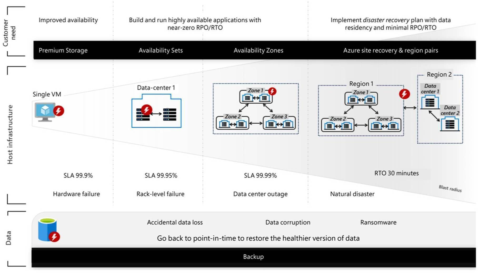
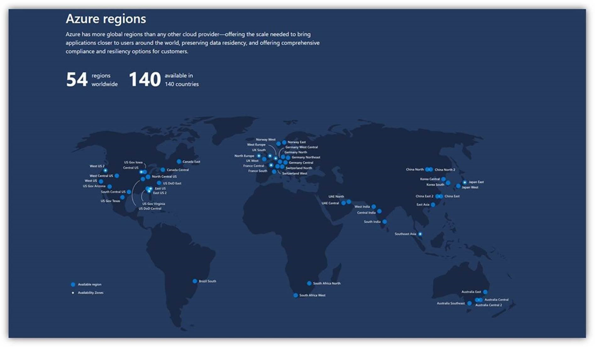

# Azure-App-Service-Availability

**App Services** is a **Platform as a Service** offering, where OS upgrades, scaling, and load balancing are handled by the platform itself.
 
An App Service scale unit has several pools of Workers pre-provisioned and ready to host your application. The compute resources of these Workers are defined by the App Service Plan, which in-turn is a collection of VM's which have same compute resources. App Services are hosted on VMs and these are managed by the platform.

 
 

 

The number of instances of the App Service infer the number of VMs on which the App Service is running.
 
In order to ensure that the App Service is resilient, it is important to make sure that the instance on which the App Service is running on, is healthy. Since the App Service is the **PaaS** offering and the infrastructure is taken care of by Microsoft. We ensure to regularly update the domain, patch the system and the assure that the instance are available for our Customers.
 
However, it is rare; but possible that the app can face some downtime if the instance undergoes any platform upgrade or maintenance.

Therefore to increase the resiliency at the instance level; **our recommendation would be maintain two or more instances allocated for your App Service.** 
 
However, the platform always has an additional instance i.e. even though there is only one instance of the App Service, which would be hosted in a different rack and these two instances would be in two different update domains and also in different fault domains. So if one rack has a hardware failure and takes down one VM with it, we can still use the other one right away. 
  
Now let’s take a step back, you may wonder how would a situation be handled if the Scale unit is itself affected? Azure is also prepared to handle such situations. We internally implement a concept that we call **Availability zones**. This ensures to protect your applications and data from datacenter failures across multiple physical locations with a region.
 
However, do note that not all regions have Availability Zones. Below is the pictorial representation of the Azure Regions and their Availability Zones – 

Further zooming out to see the bigger picture, you may also want to understand how could you further improve you App Service availability making them resilient to natural calamities affecting the regions your apps reside in.
It is important to understand that the responsibility of maintaining such a requirement is shared between the Cloud Provider and Owner of the applications.
 
You can always take preventive measures of deploying the applications among two or more regions depending on the criticality of the application. The Application can be deployed to multiple regions marking them as Primary and Secondary regions respectively. 

With the use of **Azure FrontDoor** or **Azure Traffic Manager** can ensure to route the requests to the secondary region, ensuring that the app is available to our customers even if the primary region encounters a disaster.
  
Now speaking specifically in terms Azure App Service, not only the infrastructure but the application itself is also responsible for high availability and faster performance. Your application may not be solely an App Service, but could also be internally connecting with MySQL, Redis Cache or any other third party resource. It is important to understand that **SLA** applicable would be a composite one keeping in mind the **SLA of every single resource** in use.
 
Along with these it is also recommended to perform load test to analyze and understand the load that could hit your App Service. Scaling the App Service plan either **manually** or through **auto scale rules** would enable better results to your Applications.

 

# References :

* [Resilience in Microsoft Azure](https://azure.microsoft.com/mediahandler/files/resourcefiles/resilience-in-azure-whitepaper/Resilience%20in%20Azure.pdf)
* [Demystifying the magic behind App Service OS updates](https://azure.github.io/AppService/2018/01/18/Demystifying-the-magic-behind-App-Service-OS-updates.html)
* [Scale up and Scale out  in Azure App Services](https://azure.microsoft.com/en-in/blog/scaling-up-and-scaling-out-in-windows-azure-web-sites/)
* [Recover from region-wide service disruption](https://docs.microsoft.com/en-us/azure/architecture/resiliency/recovery-loss-azure-region#app-service)
* [Azure Web Apps – Reference Architectures: Improve Scalability](https://docs.microsoft.com/en-us/azure/architecture/reference-architectures/app-service-web-app/scalable-web-app)
* [Azure Web Apps – Reference Architectures: Multi-region Deployment](https://docs.microsoft.com/en-us/azure/architecture/reference-architectures/app-service-web-app/multi-region)
