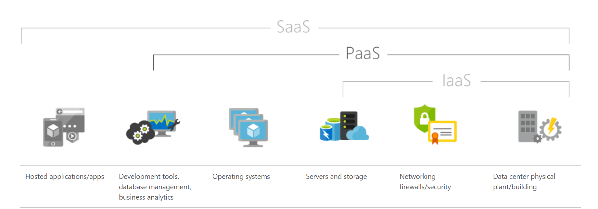
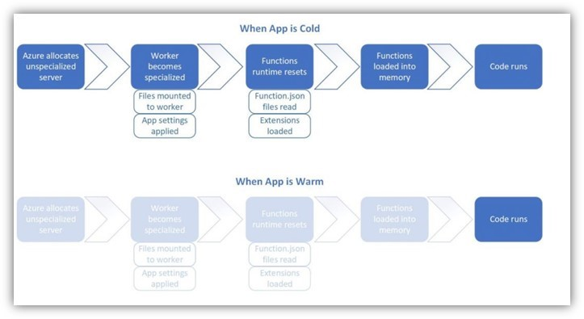
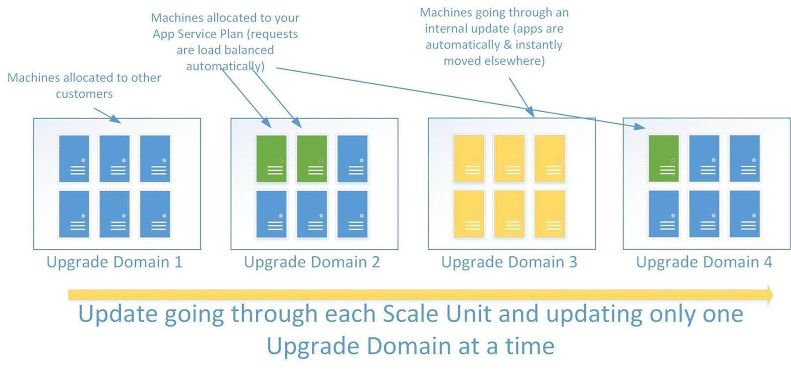

# Azure-App-Service-Availability

**_Azure App Service_** is an HTTP-based service for hosting web applications, REST APIs, and mobile back ends. You can develop in your favorite language, be it .NET, .NET Core, Java, Ruby, Node.js, PHP, or Python.

App Service scale unit has several pools of Workers pre-provisioned and ready to host your application. The compute resources of these Workers are defined by the App Service Plan (that you choose), which in-turn is a collection of VM's which have same compute resources.

The number of instances of the App Service infer the number of VMs on which the App Service is running.

App Services is a **_Platform as a Service_** offering, where both the Cloud Service Provider and the Consumer share responsibility and accountability. The CSP (in this case Azure) manages the platform, the OS upgrades and load balancing. This leaves the consumer with more room to focus on the application and data.

 
 

 

 

Having said that, let’s look at some recommended practices that we as the owner of the applications can take to make them more resilient and highly available – 

To begin with, it is always recommended to host our application on at least two instances to ensure the availability of the application. If for any reason an instance is not available, we know that the other instance which is up and running; still serving the users. It is always important to ensure enough compute resources have been allocated for the application to enable smooth performance, even at the times of heavy load.

We can always manually scale the instances to any number that we think is required for the smooth performance. But while this requires constant monitoring and manual intervention, would it not be nice if it could be automatically done? 

The **_Auto scale_** feature with Azure allows us to do the magic here.

We can choose to scale horizontally(adding/removing instances that run the service) or vertically(increase/decrease the capacity of the instances that run the service). In regards with Azure App Service, the necessary scale actions can be taken based on the conditions you choose.

Now that we have made sure that the compute resources would be allocated/deallocated according to the demands of the situation; would it not be nice if the Application performance can also be enhanced?

The easiest and often ignored problem is **cold start**. What’s important to understand is that these  compute resources can get deallocated in case of application inactivity; that is, if no requests have been made to the App Service for over 20mins, and the existing instance is not busy processing the earlier requests – the instance would be freed up (deallocated). When this happens, cold start condition may surface. 

Hence, cold start is a term used to describe the delay in the first request made to an application upon startup. One of the most common reasons for cold start is the automatic instance deallocation that we discussed earlier. Therefore, idleness of the application causes latency and in turn affects the performance.

 
 

  

 

The easiest way out is, to make use of the **AlwaysOn** feature. A web app can time out after **20 minutes of inactivity**. Only requests to the actual web app reset the timer. Therefore, the AlwaysOn feature would help keep the app loaded even when there's no traffic. With the Always On feature, you can’t control the endpoint. It always sends a request to the application root.

If you wish to customize the path that receives the warmup request, you can make use of the Application Initialization Module. This process doesn’t make the startup process _faster_, but starts the process _sooner_.  The fun part is: when making use of scaling within Azure Apps, this mechanism can be used to warmup the specific new azure app service instances.

In case your application is highly critical – it is always a best practice to **geo replicate the application**. In this case resources like Azure Front Door or the Traffic Manager etc are used to route the requests to either Web app based on the conditions you decide (eg – keeping the app in a region A as the primary one and the other as secondary). This can help prepare in advance from any unforeseen calamities and natural disaster.  There are already well elaborated articles on how we can consume these networking components with App Services – 

* [Using Azure Front Door with App Services](https://www.e-apostolidis.gr/microsoft/azure/securely-scale-your-web-apps-with-azure-front-door/)
* [Controlling App Service Traffic with App Services](https://docs.microsoft.com/en-us/azure/app-service/web-sites-traffic-manager)

 

To reiterate, App Service scale unit has several pools of Workers pre-provisioned and ready to host your application. These Scale Units always have spare capacity to handle a single-instance failure or any other unforeseen situations. This buffer capacity is also used to handle scale-out requests and in turn help with availability and resiliency in App Services.

Along with this there are periodic health checks that the platform conducts to monitor the state of the instances that run the services. There are automated mitigation steps in place to catch any issues and automatically resolve them to provide a seamless experience. 

To ensure that the App Service is resilient, it is important to make sure that the instance on which the App Service is running, is healthy and up to date. We ensure to regularly update the domain, patch the system and the assure that the instance are available for our Customers.

 

 

These multiple instances then are divided and hosted among different racks. These instances would be in different update domains and in different fault domains. So, if one rack has a hardware failure and takes down one VM with it, our app is not down, as we can continue to use the other VM’s.

You may wonder if you can replicate the data, application, and related resources into multiple datacenters in the same region for enhanced safety. We internally implement a concept that we call **Availability zones**. This ensures to protect your applications and data from datacenter failures across multiple physical locations within a region.

*[App Service Environments](https://docs.microsoft.com/en-us/azure/app-service/environment/intro) have the support for Availability Zones.

Customers can choose to optionally deploy internal load balancer (ILB) ASEs into a specific Availability Zone within an Azure region, and the resources used by that ILB ASE will either be pinned to the specified AZ, or deployed in a zone redundant manner.
Do note that the external facing ASE’s do not have the support for this feature as of now.

Also, not all regions have Availability Zones. Below is the pictorial representation of the Azure Regions and their Availability Zones –

**_Microsoft’s commitments for uptime and connectivity is described_** through Service Level Agreement or SLA. Now speaking specifically in terms Azure App Service, not only the infrastructure but the application itself is also responsible for high availability and faster performance. Your application may not be solely an App Service, but could also be internally connecting with MySQL, Redis Cache or any other third-party resource. It is important to understand that SLA applicable would be a composite one keeping in mind the **SLA of every single resource** in use.

 

# References :

* [IaaS,PaaS and SaaS](https://azure.microsoft.com/en-in/overview/what-is-paas/)
* [Understanding Cold Start](https://azure.microsoft.com/en-in/blog/understanding-serverless-cold-start/)
* [App Init Concepts](https://blog.baslijten.com/warmup-your-application-on-azure-app-service-when-scaling-up-and-swapping-slots-using-application-initialization/)
* [App Init with Azure App Service](https://docs.microsoft.com/en-us/azure/app-service/deploy-staging-slots)
* [Resilience in Microsoft Azure](https://azure.microsoft.com/mediahandler/files/resourcefiles/resilience-in-azure-whitepaper/Resilience%20in%20Azure.pdf)
* [Demystifying the magic behind App Service OS updates](https://azure.github.io/AppService/2018/01/18/Demystifying-the-magic-behind-App-Service-OS-updates.html)
* [Scale up and Scale out  in Azure App Services](https://azure.microsoft.com/en-in/blog/scaling-up-and-scaling-out-in-windows-azure-web-sites/)
* [Azure Web Apps – Reference Architectures: Improve Scalability](https://docs.microsoft.com/en-us/azure/architecture/reference-architectures/app-service-web-app/scalable-web-app)
* [Azure Web Apps – Reference Architectures: Multi-region Deployment](https://docs.microsoft.com/en-us/azure/architecture/reference-architectures/app-service-web-app/multi-region)
* [ASE Support For Availability Zones](https://azure.github.io/AppService/2019/12/12/App-Service-Environment-Support-for-Availability-Zones.html)
